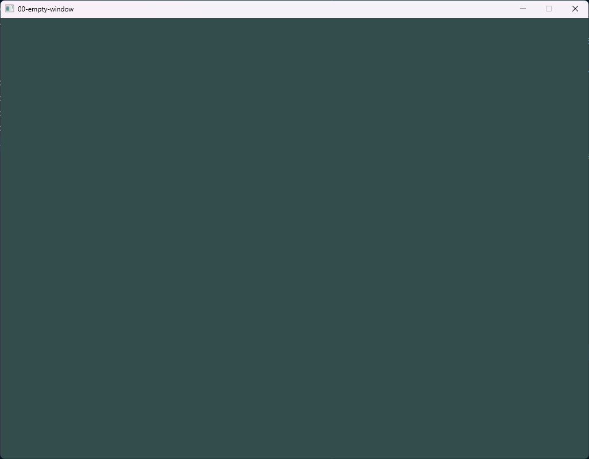
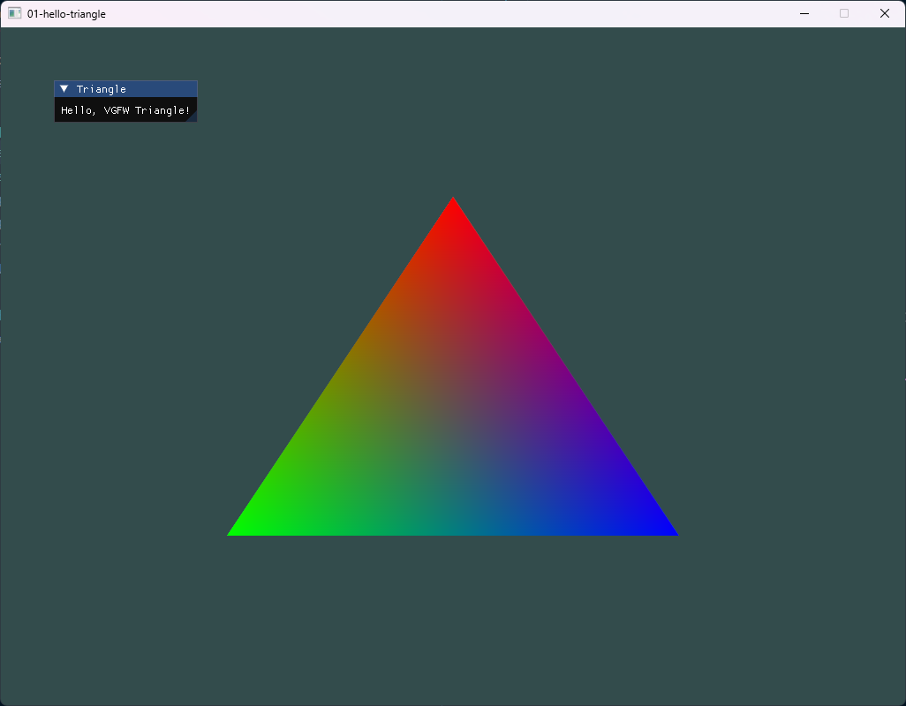
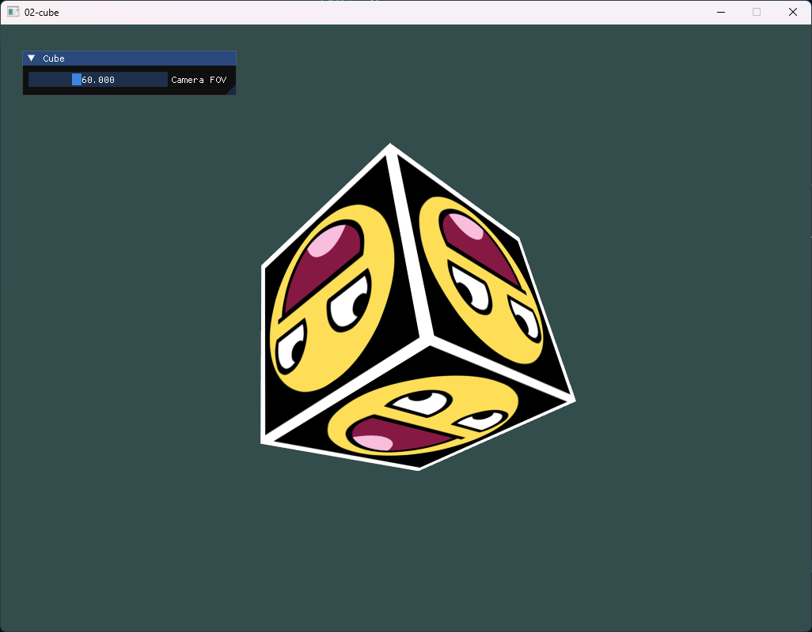
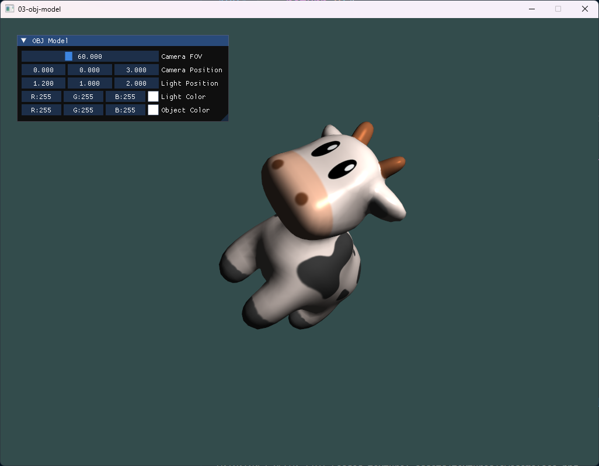
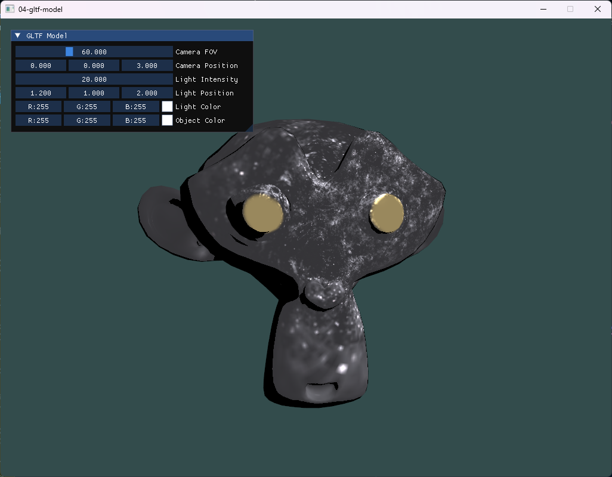
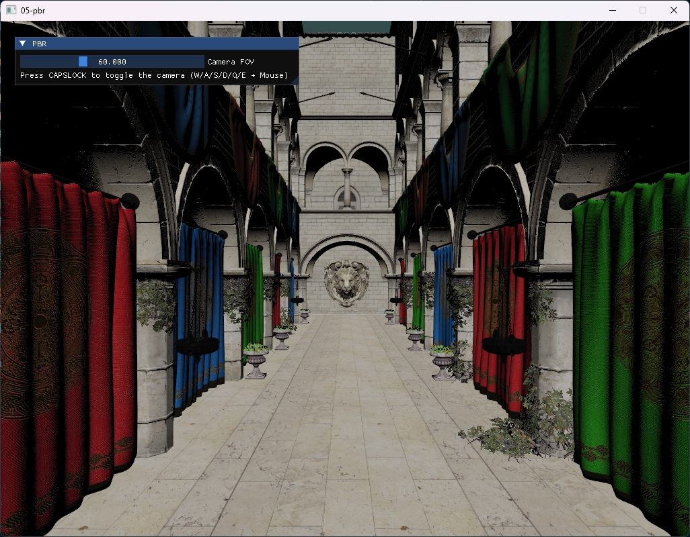
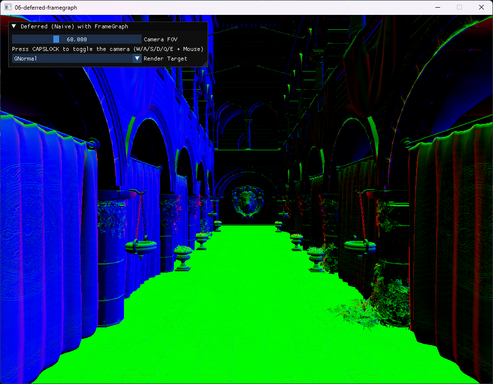
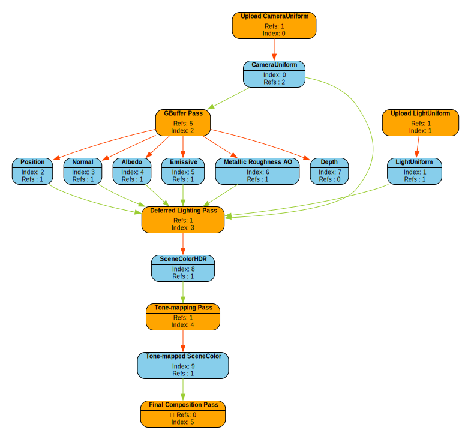

# VGFW

<p align="center">
  VGFW (<strong>V</strong> <strong>G</strong>raphics <strong>F</strong>rame<strong>W</strong>ork) is a header-only library designed for rapidly creating graphics prototypes.
</p>

<p align="center">
    <a href="https://github.com/zzxzzk115/vgfw/actions" alt="CI-Windows">
        </a>
    <a href="https://github.com/zzxzzk115/vgfw/actions" alt="CI-Linux">
        </a>
    <a href="https://github.com/zzxzzk115/vgfw/issues" alt="GitHub Issues">
        
    </a>
    <a href="https://github.com/zzxzzk115/vgfw/blob/master/LICENSE" alt="GitHub">
        
    </a>
    <a href="https://app.codacy.com/gh/zzxzzk115/vgfw/dashboard?utm_source=gh&utm_medium=referral&utm_content=&utm_campaign=Badge_grade">
        
    </a>
</p>

<div align="center">
  Currently it's available on Windows & Linux with OpenGL 4.6.
</div>

## Features

- **Header-only, with modern popular dependencies**
- **Easy to use & lightweight APIs**
- **OBJ, glTF supported**
- **FrameGraph supported**
- **Tracy profiler supported**

## Build VGFW examples with XMake

### Prerequisites

#### Windows

- [XMake](https://github.com/xmake-io/xmake)
- Visual Studio 2022 (or above) with C++ Desktop Development Environment
- Git 2.1 (or above)

#### Linux

#### Ubuntu / Other Debian Systems

To install XMake, simply use curl:

```bash
curl -fsSL https://xmake.io/shget.text | bash
```

Install other packages:

```bash
sudo apt-get install build-essential gcc-13 g++-13 cmake git libx11-dev libxrandr-dev libxrender-dev libglvnd-dev libxinerama-dev libxcursor-dev libxi-dev
```

### Build

Clone this repo and go to the root directory first:

```bash
git clone git@github.com:zzxzzk115/vgfw.git
cd vgfw
xmake -v -y
```

You can also build it with CMake, Premake if you want. Just need to handle the denpendencies:

- [FrameGraph](https://github.com/skaarj1989/FrameGraph)
- [glad](https://github.com/Dav1dde/glad)
- [glm](https://github.com/g-truc/glm)
- [glfw](https://github.com/glfw/glfw)
- [imgui](https://github.com/ocornut/imgui)
- [spdlog](https://github.com/gabime/spdlog)
- [stb](https://github.com/nothings/stb)
- [tinyobjloader](https://github.com/tinyobjloader/tinyobjloader)
- [tinygltf](https://github.com/syoyo/tinygltf)
- [tracy](https://github.com/wolfpld/tracy) (optional)

### Macros

Enable Tracy Profiler: `VGFW_ENABLE_TRACY`

Enable OpenGL Named Marker: `VGFW_ENABLE_GL_DEBUG`

## Get started

Empty window:

```cpp
#define VGFW_IMPLEMENTATION
#include "vgfw.hpp"

int main()
{
    // Init VGFW
    if (!vgfw::init())
    {
        std::cerr << "Failed to initialize VGFW" << std::endl;
        return -1;
    }

    // Create a window instance
    auto window = vgfw::window::create({.title = "00-empty-window"});

    // Init renderer
    vgfw::renderer::init({.window = window});

    // Get graphics & render context
    auto& rc = vgfw::renderer::getRenderContext();

    // Main loop
    while (!window->shouldClose())
    {
        window->onTick();

        vgfw::renderer::beginFrame();

        // Render
        rc.beginRendering({.extent = {.width = window->getWidth(), .height = window->getHeight()}},
                          glm::vec4 {0.2f, 0.3f, 0.3f, 1.0f});

        vgfw::renderer::endFrame();

        vgfw::renderer::present();
    }

    // Cleanup
    vgfw::shutdown();

    return 0;
}
```

Your first triangle:

```cpp
#define VGFW_IMPLEMENTATION
#include "vgfw.hpp"

const char* vertexShaderSource = R"(
#version 450

layout(location = 0) in vec3 aPos;
layout(location = 1) in vec3 aColor;

out vec3 vertexColor;

void main()
{
    gl_Position = vec4(aPos, 1.0);
    vertexColor = aColor;
}
)";

const char* fragmentShaderSource = R"(
#version 450

in vec3 vertexColor;

out vec4 FragColor;

void main()
{
    FragColor = vec4(vertexColor, 1.0);
}
)";

int main()
{
    // Init VGFW
    if (!vgfw::init())
    {
        std::cerr << "Failed to initialize VGFW" << std::endl;
        return -1;
    }

    // Create a window instance
    auto window = vgfw::window::create({.title = "01-hello-triangle", .aaSample = vgfw::window::AASample::e8});

    // Init renderer
    vgfw::renderer::init({.window = window});

    // Get render context
    auto& rc = vgfw::renderer::getRenderContext();

    // Build vertex format
    auto vertexFormat = vgfw::renderer::VertexFormat::Builder {}
                            .setAttribute(vgfw::renderer::AttributeLocation::ePosition,
                                          {.vertType = vgfw::renderer::VertexAttribute::Type::eFloat3, .offset = 0})
                            .setAttribute(vgfw::renderer::AttributeLocation::eNormal_Color,
                                          {.vertType = vgfw::renderer::VertexAttribute::Type::eFloat3, .offset = 12})
                            .build();

    // Get vertex array object
    auto vao = rc.getVertexArray(vertexFormat->getAttributes());

    // Create shader program
    auto program = rc.createGraphicsProgram(vertexShaderSource, fragmentShaderSource);

    // Build a graphics pipeline
    auto graphicsPipeline = vgfw::renderer::GraphicsPipeline::Builder {}
                                .setDepthStencil({
                                    .depthTest      = false,
                                    .depthWrite     = true,
                                    .depthCompareOp = vgfw::renderer::CompareOp::eLess,
                                })
                                .setRasterizerState({
                                    .polygonMode = vgfw::renderer::PolygonMode::eFill,
                                    .cullMode    = vgfw::renderer::CullMode::eBack,
                                    .scissorTest = false,
                                })
                                .setVAO(vao)
                                .setShaderProgram(program)
                                .build();

    // clang-format off
    // Vertices
    float vertices[] = {
        //   Position            // Color
         0.0f,  0.5f, 0.0f,   1.0f, 0.0f, 0.0f,
        -0.5f, -0.5f, 0.0f,   0.0f, 1.0f, 0.0f,
         0.5f, -0.5f, 0.0f,   0.0f, 0.0f, 1.0f
    };

    // Indices
    uint32_t indices[] = {
        0, 1, 2
    };
    // clang-format on

    // Create index buffer & vertex buffer
    auto indexBuffer  = rc.createIndexBuffer(vgfw::renderer::IndexType::eUInt32, 3, indices);
    auto vertexBuffer = rc.createVertexBuffer(vertexFormat->getStride(), 3, vertices);

    // Main loop
    while (!window->shouldClose())
    {
        window->onTick();

        vgfw::renderer::beginFrame();

        // Render
        rc.beginRendering({.extent = {.width = window->getWidth(), .height = window->getHeight()}},
                          glm::vec4 {0.2f, 0.3f, 0.3f, 1.0f});
        rc.bindGraphicsPipeline(graphicsPipeline).draw(vertexBuffer, indexBuffer, 3, 3);

        ImGui::Begin("Triangle");
        ImGui::Text("Hello, VGFW Triangle!");
        ImGui::End();

        vgfw::renderer::endFrame();

        vgfw::renderer::present();
    }

    // Cleanup
    rc.destroy(indexBuffer);
    rc.destroy(vertexBuffer);
    vgfw::shutdown();

    return 0;
}
```

Please see more examples in `examples` folder.

## Examples

**00-empty-window:**



**01-hello-triangle:**



**02-cube:**



**03-obj-model:**



**04-gltf-model:**



**05-pbr:**



**06-deferred-framegraph:**





## Acknowledgements

We would like to thank the following projects for their invaluable contribution to our work:

- [spdlog](https://github.com/gabime/spdlog) (Logger)
- [imgui](https://github.com/ocornut/imgui) (GUI)
- [glad](https://github.com/Dav1dde/glad) (OpenGL Loader & Extension)
- [glfw](https://github.com/glfw/glfw) (Window Abstraction)
- [glm](https://github.com/g-truc/glm) (Math library)
- [stb](https://github.com/nothings/stb) (Image Loader)
- [tracy](https://github.com/wolfpld/tracy) (Frame Profiler)
- [tinyobjloader](https://github.com/tinyobjloader/tinyobjloader) (OBJ Loader)
- [tinygltf](https://github.com/syoyo/tinygltf) (glTF Loader)
- [FrameGraph](https://github.com/skaarj1989/FrameGraph) (FrameGraph Implementation)
- [FrameGraph-Example](https://github.com/skaarj1989/FrameGraph-Example) (The Best Practice of FrameGraph OpenGL Implementation)

## License

This project is licensed under the [MIT](https://github.com/zzxzzk115/vgfw/blob/master/LICENSE) license.
